# VelixAI - Advanced Communication Coach 🧠🗣️

VelixAI is a full-stack, AI-powered platform designed to help professionals master their spoken communication skills, conquer presentation anxiety, and build cultural intelligence across a globalized workforce.

By leveraging cutting-edge real-time WebRTC and ultra-low latency Large Language Models, VelixAI provides a hyper-realistic, conversational voice environment where users can practice high-stakes scenarios — from salary negotiations and engineering whiteboarding to impromptu debate spars — receiving deeply analytical feedback on fluency, cadence, grammar, and vocabulary.

## 🌟 Core Features

- **Practice Scenarios**: Engage in dynamic text or fully voice-driven WebRTC simulations (Job Interviews, Executive Meetings, Daily Conversation, etc.).
- **Debate Arena**: Sharpens critical thinking and argumentation by forcing users to defend challenging impromptu topics against a highly logical AI agent.
- **Mock Interviews**: Automatically extracts skills from pasted Job Descriptions, challenging the user with hyper-targeted, role-specific questions.
- **Anxiety Coach**: Provides cognitive reframing, guided breathing exercises, and speech readiness checks to mitigate glossophobia before high-stakes presentations.
- **Culture Room**: A CQ (Cultural Intelligence) module showcasing meeting norms, taboos, and a "Phrase of the Day" across dozens of business hubs worldwide.
- **Talk Patterns Dashboard**: Visualizes the user's historical telemetry in premium heatmap and bar-chart configurations — tracking WPM (Words Per Minute), hesitation counts, and filler-word usage over weeks of practice.
- **Spaced-Repetition Vocabulary**: A dedicated flashcard module seamlessly integrating challenging words encountered during practice sessions.
- **Voice Journal**: A private sanctuary to vent or brainstorm ideas via voice, analyzing emotional sentiment securely.

---

## 🛠️ Third-Party Services & Technical Stack

VelixAI is architected for real-time scale and minimal audio latency.

### Front-End Application
- **React 19 & Vite**: The foundational UI framework.
- **Zustand**: Centralized state management syncing the user's telemetry, goals, and profiles.
- **Tailwind CSS & Framer Motion**: Deep glassmorphism aesthetics, dynamic HSL gradients, and butter-smooth micro-interactions.
- **Chart.js**: Fully customized for rendering complex user interaction history.

### Back-End APIs & Telemetry
- **FastAPI**: Asynchronous Python micro-framework powering the REST endpoints.
- **PostgreSQL**: The core relational datastore.
- **SQLAlchemy 2.0 (Async)**: ORM bindings to bridge python domain models into the persistence layer.

### Voice AI Pipeline (WebRTC)
- **LiveKit (WebRTC Protocol)**: Bypasses standard HTTP/WebSocket limitations by opening a UDP-based Real-Time Communication channel directly between the browser and the AI worker process.
- **Groq Inference Engine**: 
  - **Llama-3 (70B)**: Serves as the conversational brain of the coach. Triggers < 100ms time-to-first-token responses.
  - **Whisper (Large-V3)**: Near-instant Speech-to-Text transcription.
- **Cartesia**: Sub-second text-to-speech engine utilizing the multi-modal `sonic-3` model to breathe emotion, pausing, and authentic cadence into the AI's spoken voice.

---

## 🗄️ Domain Models & Database Schema

The persistence layer rigorously logs telemetric data from users across independent scenarios to fuel the global machine-learning aggregation views.



## 🚀 Getting Started

The environment runs natively via bash daemons:

```bash
# 1. Boot up the PostgreSQL Cluster, FastAPI server, and the LiveKit WebRTC Worker
cd backend
bash start.sh

# 2. In a separate terminal, serve the React Application
cd frontend
npm run dev
```

> **Note**: A valid `.env` file containing `LIVEKIT_API_KEY`, `GROQ_API_KEY`, and `CARTESIA_API_KEY` must be populated inside both the `/backend` and `/frontend` roots to initialize the voice pipeline securely.
